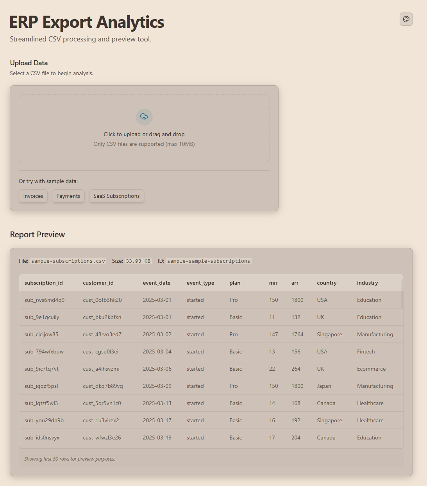
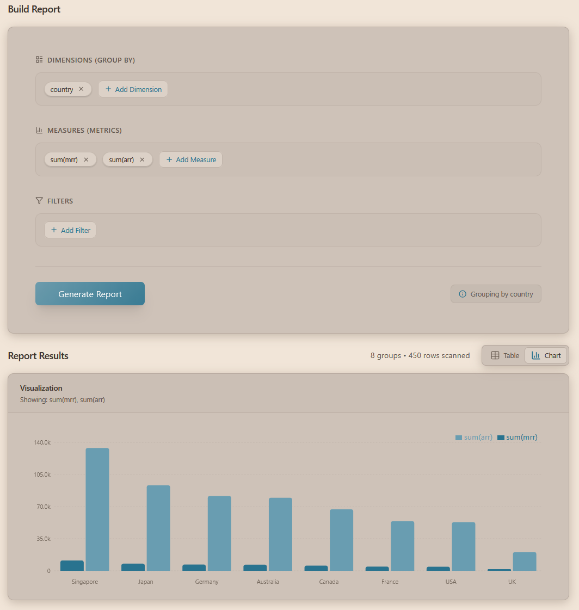

# ERP Export Analytics

### UI Preview




### Description

This project is a browser-based CSV analytics tool built with React and TypeScript. It allows users to upload a CSV file, build reports by selecting dimensions (group by), metrics (aggregations), and filters, and then visualize the results as a table or chart.

### Features

- CSV file upload and processing.
- Multi-dimensional grouping (group by).
- Aggregation metrics (Count, Sum, Average).
- High cardinality detection for dimensions.
- Table and chart visualizations using Recharts.
- Collapsible report preview for initial data inspection.
- Two-column layout for builder and results.
- Dark and light theme support.

### How it Works

- **Dimensions**: Fields used to group data. Each unique combination of dimensions becomes a row in the result.
- **Metrics**: Quantitative calculations (Count, Sum, Average) performed on the groups.
- **Filters**: Conditions applied to the raw data to include or exclude rows before aggregation.

### Running Locally

Prerequisites: Node.js (v22+) and Go (v1.26+).

#### Backend

```bash
cd apps/api
go run main.go
```

The API listens on `:8080`.

#### Frontend

```bash
cd apps/web
npm install
npm run dev
```

The application will be accessible at `http://localhost:5173`.

#### Using the Makefile

```bash
# Frontend
make web-install
make web-dev

# Backend
make api-dev
```

### Example Dataset Usage

The project includes sample datasets in `apps/api/data/samples/`:

- `sample-invoices.csv`: Analyze invoices by client, status, or date.
- `sample-payments.csv`: Track payment methods and amounts.
- `sample-subscriptions.csv`: Monitor subscription plans and revenue.

### Tech Stack

- **Frontend**: React 19, TypeScript, Tailwind CSS 4, Recharts, Lucide React, Vitest.
- **Backend**: Go 1.26, standard library.
- **Tools**: Makefile for common tasks.
